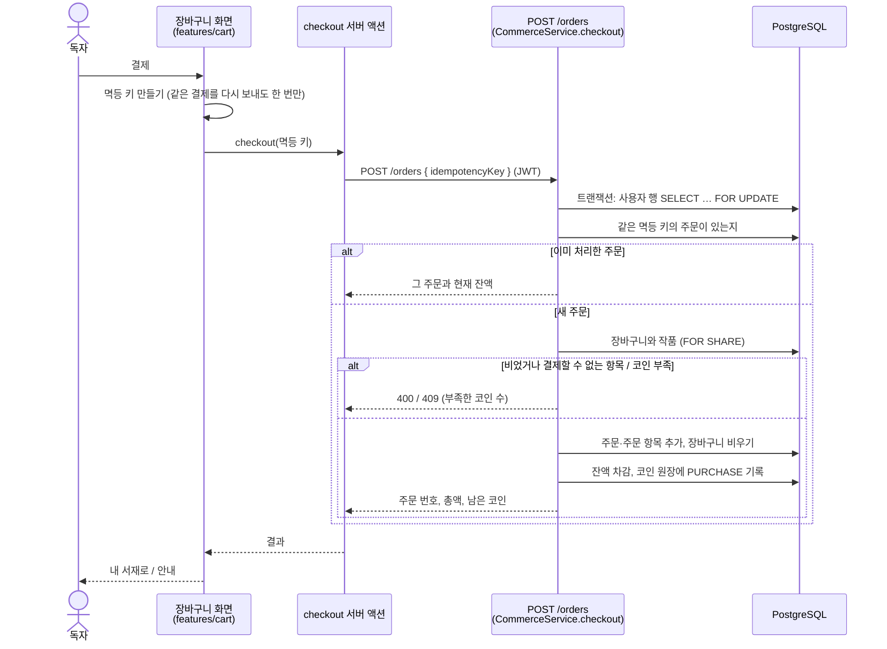
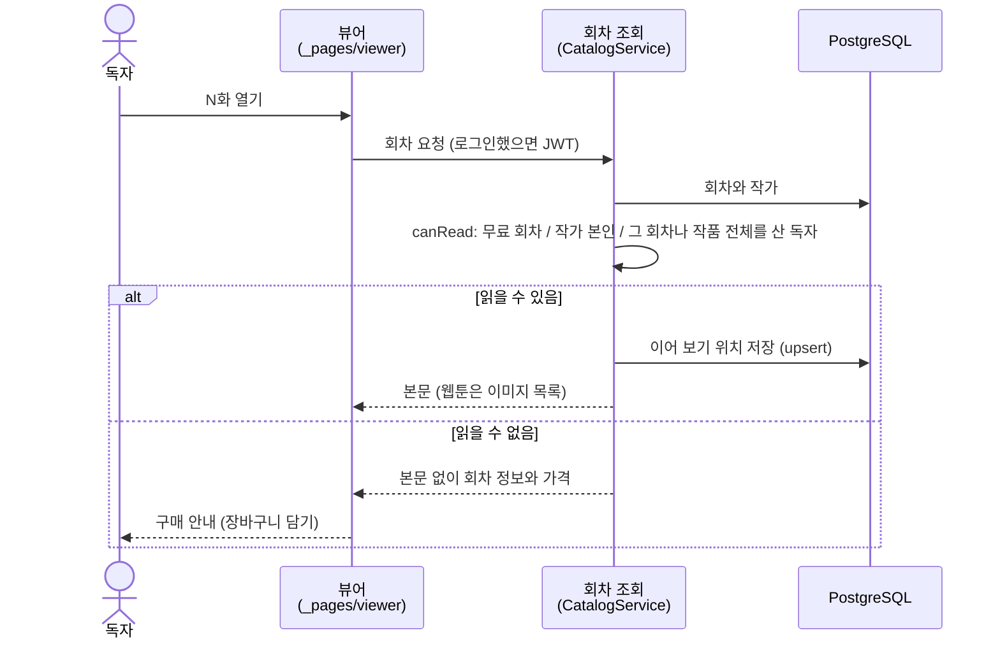
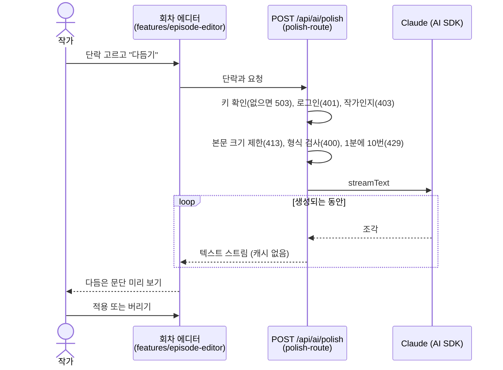

# 시퀀스 다이어그램

RAON의 주요 흐름입니다. 웹(`apps/web`, Next.js)은 서버 액션에서 NestJS API(`apps/api`)를 JWT로 부르고, 데이터는 PostgreSQL(Drizzle)에 있습니다.

## 1. 장바구니 코인 결제

```mermaid
sequenceDiagram
    actor 독자
    participant 장바구니 as 장바구니 화면<br/>(features/cart)
    participant 액션 as checkout 서버 액션
    participant API as POST /orders<br/>(CommerceService.checkout)
    participant DB as PostgreSQL

    독자->>장바구니: 결제
    장바구니->>장바구니: 멱등 키 만들기 (같은 결제를 다시 보내도 한 번만)
    장바구니->>액션: checkout(멱등 키)
    액션->>API: POST /orders { idempotencyKey } (JWT)
    API->>DB: 트랜잭션: 사용자 행 SELECT … FOR UPDATE
    API->>DB: 같은 멱등 키의 주문이 있는지
    alt 이미 처리한 주문
        API-->>액션: 그 주문과 현재 잔액
    else 새 주문
        API->>DB: 장바구니와 작품 (FOR SHARE)
        alt 비었거나 결제할 수 없는 항목 / 코인 부족
            API-->>액션: 400 / 409 (부족한 코인 수)
        else
            API->>DB: 주문·주문 항목 추가, 장바구니 비우기
            API->>DB: 잔액 차감, 코인 원장에 PURCHASE 기록
            API-->>액션: 주문 번호, 총액, 남은 코인
        end
    end
    액션-->>장바구니: 결과
    장바구니-->>독자: 내 서재로 / 안내
```

## 2. 회차 열기와 유료 본문 차단

```mermaid
sequenceDiagram
    actor 독자
    participant 뷰어 as 뷰어<br/>(_pages/viewer)
    participant API as 회차 조회<br/>(CatalogService)
    participant DB as PostgreSQL

    독자->>뷰어: N화 열기
    뷰어->>API: 회차 요청 (로그인했으면 JWT)
    API->>DB: 회차와 작가
    API->>API: canRead: 무료 회차 / 작가 본인 / 그 회차나 작품 전체를 산 독자
    alt 읽을 수 있음
        API->>DB: 이어 보기 위치 저장 (upsert)
        API-->>뷰어: 본문 (웹툰은 이미지 목록)
    else 읽을 수 없음
        API-->>뷰어: 본문 없이 회차 정보와 가격
        뷰어-->>독자: 구매 안내 (장바구니 담기)
    end
```

## 3. 작가 에디터의 AI 문단 다듬기

```mermaid
sequenceDiagram
    actor 작가
    participant 에디터 as 회차 에디터<br/>(features/episode-editor)
    participant 라우트 as POST /api/ai/polish<br/>(polish-route)
    participant 클로드 as Claude (AI SDK)

    작가->>에디터: 단락 고르고 "다듬기"
    에디터->>라우트: 단락과 요청
    라우트->>라우트: 키 확인(없으면 503), 로그인(401), 작가인지(403)
    라우트->>라우트: 본문 크기 제한(413), 형식 검사(400), 1분에 10번(429)
    라우트->>클로드: streamText
    loop 생성되는 동안
        클로드-->>라우트: 조각
        라우트-->>에디터: 텍스트 스트림 (캐시 없음)
    end
    에디터-->>작가: 다듬은 문단 미리 보기
    작가->>에디터: 적용 또는 버리기
```
